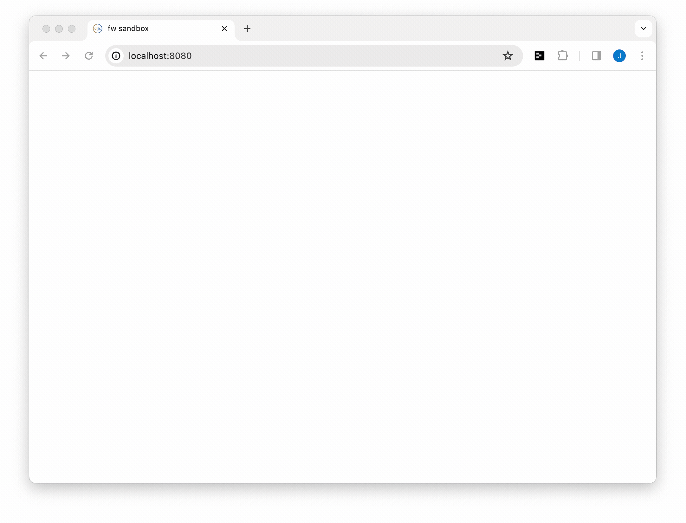

# Devtools Console Customizer
This is a Chrome extension for customizing the font and background-color of the DevTools Console.

<a href="https://chromewebstore.google.com/detail/kjkmaoifmppnclfacnmbimcckfgekmod" target="_blank">Install via the official extension page →</a>

Currently, this extension only works for Chromium browsers. If you using Firefox, you can still achieve the same customizations by following the instructions outlined in [Firefox Developer Tools section](#setting-the-background-color-and-font-in-firefox-developer-tools) below.

 

## Why?
Because you may want the appearance of things printed to the browser dev console to more closely match the theme in your source-code editor.

 

## Aligning your console background color and font
Most pretty-printing utilities designed to support syntax-coloring (theming) for browser dev tool consoles can only color the foreground and background of "spans" of text. If you want to perfectly match the themed experience of your source code editor, you will need to manually set the font-family and background color of your browser dev console.

 

### Setting the background color and font in Chromium DevTools 
If you are using Firefox, ignore this section and follow [the instructions in the following section](#setting-the-background-color-and-font-in-firefox-developer-tools).

First, you will need to set the general appearance of your Chromium browser's DevTools UI to "Light" or "Dark", depending on whether you are using a light or dark Fireworks theme. This can be done by opening DevTools on any page, clicking the **Settings** gear icon button, and then **Preferences** > **Appearance** > **Theme**. Official instructions <a href="https://developer.chrome.com/docs/devtools/settings" target="_blank">here</a>.

Now you can open the Devtools Console Customizer popup and customize the font-family and background color. After making a change via the extension, you will need to close and reopen DevTools. If you are switching from a light to dark theme or vice-versa, remember to also reset the general appearance of DevTools in **Settings** > **Preferences** > **Appearance** > **Theme**, as described above.

 

### Setting the background color and font in Firefox Developer Tools
Currently, this extension only available for Chromium browsers. You can, however, customize the font-family and background color of the dev console in **Firefox**, although this has to be done manually.

First, open the Firefox Developer Tools on any page - just right-click and select **Inspect**. Then click on the *`•••`* button in the top right of this panel and select **Settings** to get to the Settings panel. You should see a **Themes** section which will let you select `Light` or `Dark`.

You can achieve the equivalent customizations to the console background-color and font-family by providing a special `.css` file. This repo provides <a href="" target="_blank">a starter **`userContent.css`** file</a> to make this easy. You will need to place this file in the correct directory on your computer so that Firefox can read it when it launches. Follow the <a href="https://www.userchrome.org/how-create-userchrome-css.html" target="_blank">instructions outlined here</a> to locate this directory. Please note that file, which is necessary for customizing the Developer Tools console in FireFox, is called **`userContent.css`**,  ***NOT*** `userChrome.css` (as mentioned in the linked tutorial).  You can put this in the proper directory as explained in the <a href="https://www.userchrome.org/how-create-userchrome-css.html" target="_blank">linked tutorial</a> and change it as needed to align with your chosen theme. Remember to quit and restart Firefox if you make any changes or updates to this **`userContent.css`** file.

