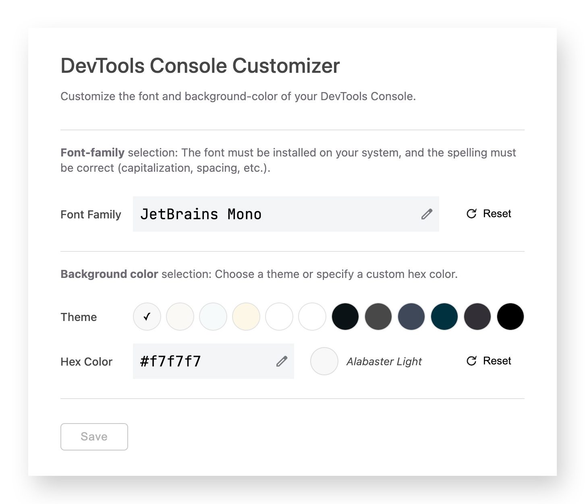

# Devtools Console Customizer
This is a Chrome extension for customizing the font and background-color of the DevTools Console.

 

### Why?
Because you may want the appearance of things printed to the browser dev console to more closely match the theme in your source-code editor.
